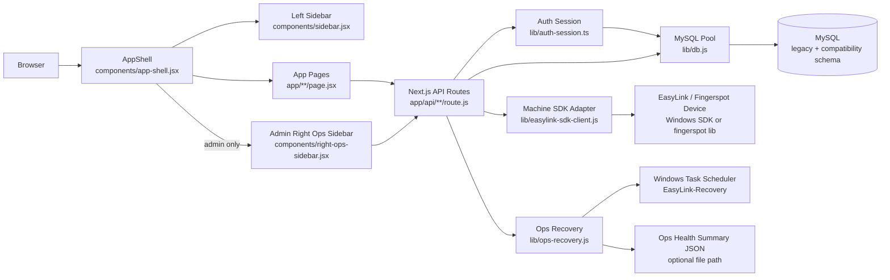
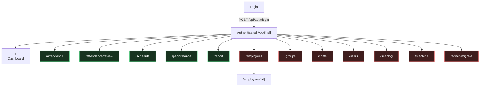
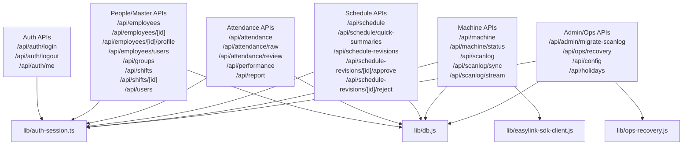
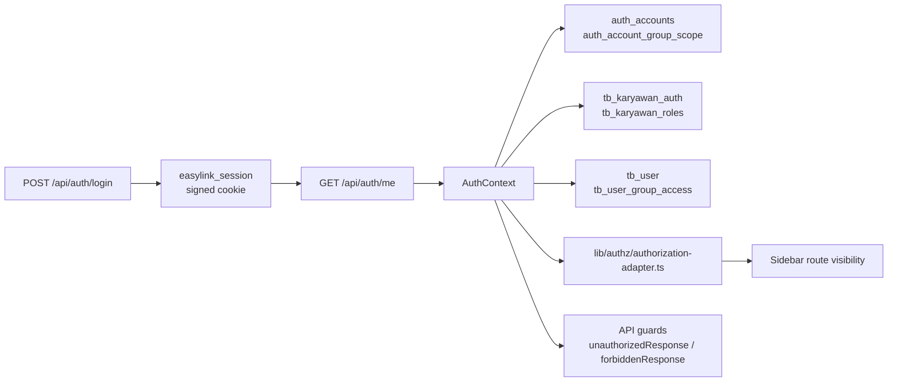
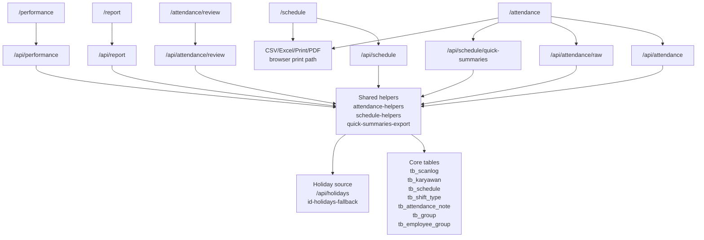
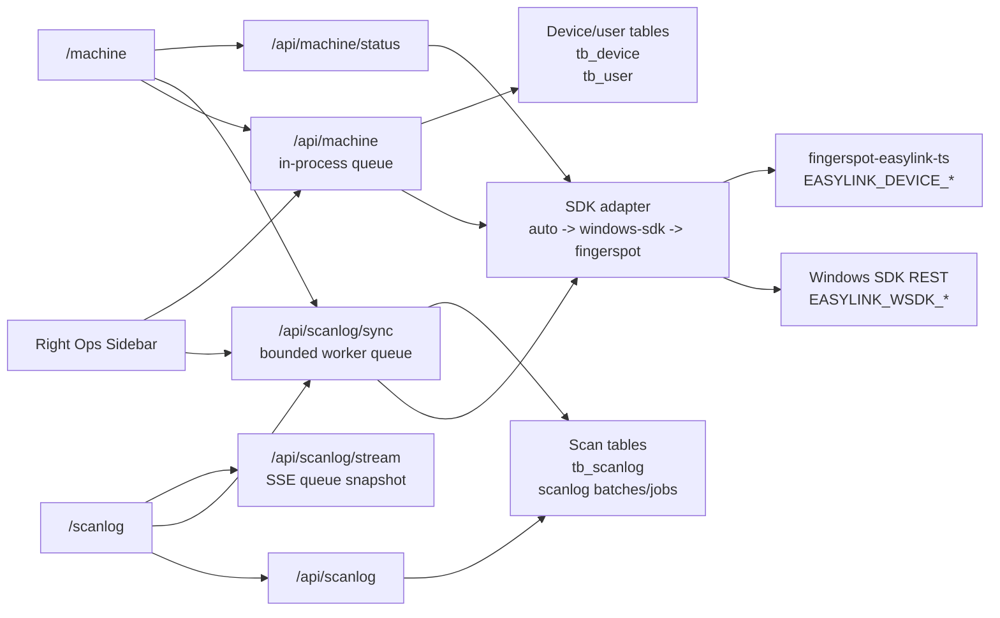
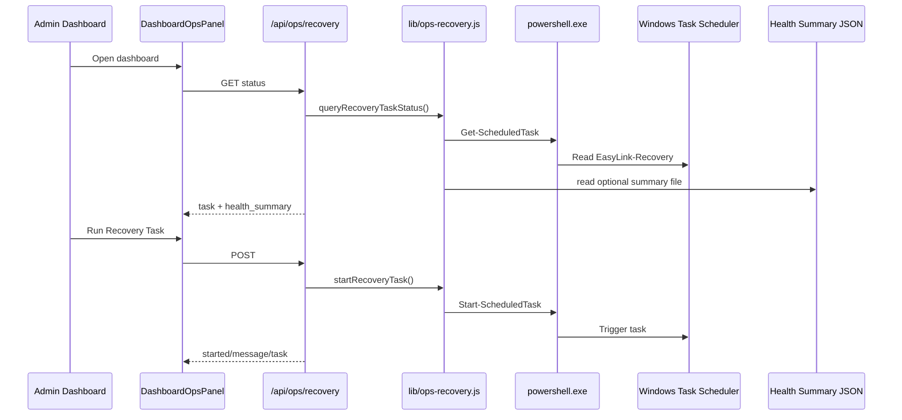
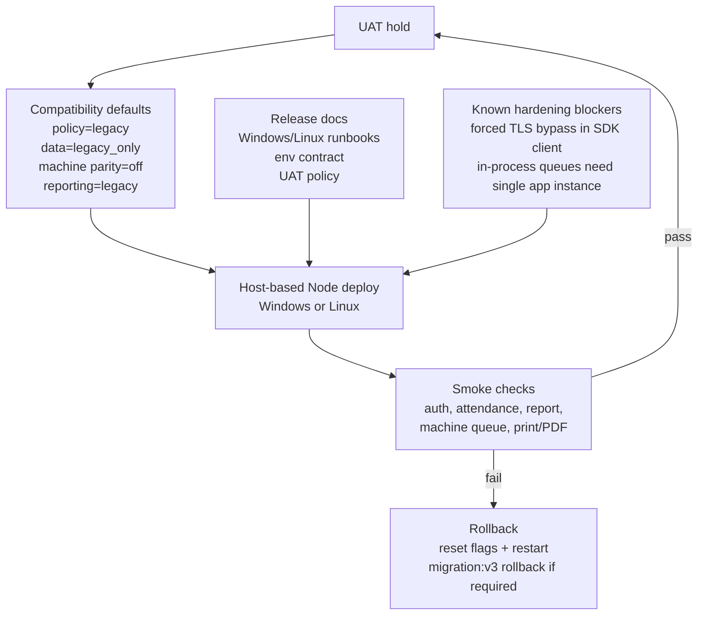

# EasyLink App Current State Graph

Last updated: 2026-04-24

This graph reflects the current workspace state, including local uncommitted `ops` recovery files.

## System Overview

## UI Route Map

## API Topology

## Auth And Authorization

## Attendance, Schedule, And Export Flow

## Machine And Scanlog Flow

## Ops Recovery Flow

## UAT And Release Gates

## Current Planning Read

| Area | State |
|---|---|
| UI shell | Left nav, right admin ops sidebar, theme and locale toggles are active. |
| Auth | Canonical account path exists with NIP and legacy PIN compatibility fallback. |
| Attendance/reporting | Main tables aggregate from scanlog, schedule, shifts, groups, notes, and holiday metadata. |
| Print/PDF | Holiday names are trimmed from compact print cells while color semantics remain. |
| Machine/scanlog | SDK-first machine integration with bounded queues and admin-only surfaces. |
| Ops recovery | Windows Task Scheduler recovery hook exists in current local state. |
| Release posture | UAT hold with compatibility-first defaults and Windows/Linux runbooks. |

