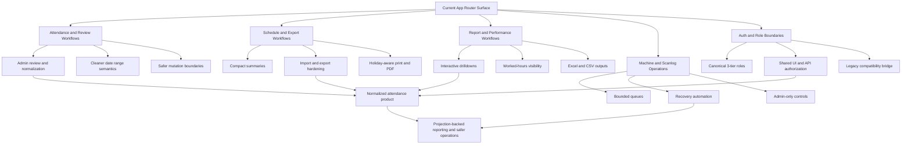

# Graphify App Direction Map

Last updated: 2026-04-27

This file is the readable, product-facing summary of the latest graphify pass for the `app/` surface. It is meant to answer one question clearly:

> Where is the EasyLink app going?

## Scope of this graph

- Graphify target: `app/`
- Corpus size: 46 files, ~49k words
- Graph result: 176 nodes, 335 edges, 19 communities
- Raw outputs:
  - `.graphify/GRAPH_REPORT.md`
  - `.graphify/graph.html`
  - `.graphify/graph.json`

This run maps route/page-level product behavior. For deeper runtime architecture, pair this file with:

- `docs/project-context.md`
- `docs/app-current-state-graph.md`
- `docs/roadmap-n-plus-one-normalization.md`
- `.sisyphus/plans/easylink-architecture-clean-slate.md`
- `docs/agent-context/next-session-master-board.md`

## Executive direction

The app is moving toward five converging outcomes:

1. **Attendance becomes a cleaner product workflow, not just a raw scanlog viewer.**
   - Attendance, review, performance, and report are being shaped into role-aware operational surfaces.
   - Review is becoming the admin normalization layer for duplicate punches, tagging, and corrections.

2. **Reporting becomes a first-class decision surface.**
   - Report, performance, and quick-summary flows are converging on better date semantics, drilldowns, exports, and worked-hours visibility.
   - The direction is toward predictable summary + drilldown views instead of ad hoc table exports.

3. **Machine operations are being isolated behind safer admin-only controls.**
   - The machine, scanlog, queue, and recovery flows are clearly becoming a dedicated operational subsystem.
   - Reliability, bounded queues, dedupe, and recovery hooks matter more than raw device access convenience.

4. **Auth is tightening toward a canonical 3-tier model.**
   - Repository plans point to `admin`, `group_leader`, and `employee` as the long-term policy model.
   - UI visibility and API authorization are being pulled toward one shared contract.

5. **The data layer is heading toward normalization and read projections.**
   - Current attendance/reporting logic still leans on heavy runtime joins.
   - The roadmap points toward projection tables, reduced N+1 behavior, and clearer identity/group/schedule mapping.

## Direction graph

## Graphify communities, translated

| Community label            | What it represents                                  | What it says about direction                                                                    |
| -------------------------- | --------------------------------------------------- | ----------------------------------------------------------------------------------------------- |
| App Pages Cluster          | The broad page-level surface in `app/**/page.jsx`   | The product surface is still wide and somewhat diffuse; page concerns are still mixed in places |
| Read API Aggregators       | GET-heavy attendance/report/reporting/read helpers  | Reads are important and central, but still too concentrated in large route files                |
| Review and Sync Mutations  | Attendance review mutations, sync jobs, queue flows | Admin mutation tooling and batch sync are active growth areas                                   |
| Identity and Config Writes | PUT/DELETE/config/identity mutation paths           | Identity cleanup and configuration are part of the longer migration story                       |
| Machine Actions            | Device info, polling, machine actions               | Machine control is a distinct subsystem, not just a utility page                                |
| Machine Job Queue          | Queueing, dedupe, processing, cancellation          | Operational safety and concurrency control are explicit concerns                                |
| Dashboard Surface          | Root dashboard behavior                             | Dashboard is becoming a launch surface for monitoring and admin actions                         |
| Scanlog Row Normalizers    | Safe row formatting and normalization helpers       | Legacy/raw scanlog data still needs cleanup layers before presentation                          |
| Attendance Surface         | `/attendance` page behavior                         | Attendance remains the central user-facing workflow                                             |
| Machine UI Surface         | `/machine` UI behavior                              | Admin device workflows are treated as their own product mode                                    |
| Scanlog UI Surface         | `/scanlog` UI behavior                              | Scanlog remains operational, not end-user-first                                                 |
| Quick Summary Helpers      | Compact date and summary helpers                    | Export and summary UX is still being actively refined                                           |
| Performance Surface        | `/performance` page behavior                        | Performance is evolving into a role-aware summary view                                          |
| Report Surface             | `/report` page behavior                             | Reporting is becoming richer and more interactive                                               |
| Report Drilldown Math      | Worked-hours and drilldown transforms               | The reporting layer is moving from raw rows to computed insight                                 |
| Chart Helpers              | Small chart support helpers                         | Visual summary views are part of the intended reporting experience                              |
| Shift Form Helpers         | Shift editing/form logic                            | Schedule tooling is still important, but narrower than attendance/reporting                     |
| Report Series Builders     | Aggregated report-series generation                 | Summary chart data is becoming a stable reporting primitive                                     |
| Root Layout                | App shell/root layout                               | Shell-level behavior is a control plane for the rest of the app                                 |

## What the graph says is central right now

Graphify marked these as the strongest hubs in `app/`:

1. `route.js`
2. `page.jsx`
3. `POST()`
4. `GET()`
5. `PUT()`

Practical meaning:

- The app is still strongly organized around large route/page entry points.
- A lot of product complexity still sits inside route handlers instead of thinner domain modules.
- The next architectural gains will come from moving repeated read/write logic out of route files and into clearer shared layers.

## Where the app is likely heading next

### 1. Attendance and reporting will converge on one consistent data story

Evidence:

- `docs/roadmap-n-plus-one-normalization.md`
- `app/api/attendance/route.js`
- `app/api/report/route.js`
- `app/api/performance/route.js`

Expected direction:

- Shared date-range semantics
- Shared worked-hours and status logic
- Projection-backed reads instead of repeated runtime aggregation
- Cleaner drilldown payloads for report/performance/attendance surfaces

### 2. Admin review becomes the controlled correction layer

Evidence:

- `app/attendance/review/page.jsx`
- `app/api/attendance/review/route.js`
- clean-slate plan references to admin-only punch review/tagging

Expected direction:

- Duplicate handling
- Soft-hide / unhide normalization
- Taxonomy tagging (`late`, `acceptable`, `invalid`)
- Better guardrails around who can mutate attendance data

### 3. Machine and recovery flows will stay isolated and hardened

Evidence:

- `app/machine/page.jsx`
- `app/scanlog/page.jsx`
- `app/api/scanlog/sync/route.js`
- `app/api/ops/recovery/route.js`

Expected direction:

- Safer queue execution
- Better recovery visibility
- Less eager polling and fewer accidental heavy requests
- More explicit admin-only operational controls

### 4. Auth and scope will keep collapsing toward a single model

Evidence:

- `.sisyphus/plans/easylink-architecture-clean-slate.md`
- `docs/agent-context/session-handoff-2026-04-19-attendance-performance-backlog.md`
- `docs/project-context.md`

Expected direction:

- Canonical 3-tier role model
- Shared auth adapter behavior across UI and API
- Less legacy capability sprawl
- Cleaner explanation of what leaders and employees can actually see

### 5. Export UX will keep becoming part of the product, not an afterthought

Evidence:

- `docs/agent-context/current-project-context.md`
- report/schedule export work in recent handoff context

Expected direction:

- Compact, readable exports
- More resilient import behavior
- Better Excel support for operational summaries
- Print/PDF behavior treated as a maintained surface

## Current pressure points

These are the main friction points visible from the graph plus the roadmap docs:

- **Large route files are still doing too much.**
  - The biggest graph hubs are still route entry points.
- **Page-level concerns are still loosely clustered.**
  - The largest page community has very low cohesion.
- **Read models are richer than the underlying structure.**
  - Reporting is asking for computed insight, but the app still leans on transactional joins.
- **Operational tooling is mature enough to need its own discipline.**
  - Machine queue and recovery behavior already look like a subsystem, not a side feature.

## Recommended next reading order

If you want to understand the future direction fast, read in this order:

1. `docs/graphify-app-direction.md` _(this file)_
2. `.graphify/GRAPH_REPORT.md`
3. `docs/app-current-state-graph.md`
4. `docs/project-context.md`
5. `.sisyphus/plans/easylink-architecture-clean-slate.md`
6. `docs/roadmap-n-plus-one-normalization.md`
7. `docs/agent-context/next-session-master-board.md`

## Bottom line

EasyLink is no longer just a biometric attendance UI.

It is moving toward a **role-scoped attendance operations platform** with:

- normalized identity and auth boundaries,
- projection-backed reporting,
- controlled admin correction workflows,
- safer machine sync/recovery operations,
- and stronger export/reporting surfaces for real operational use.
