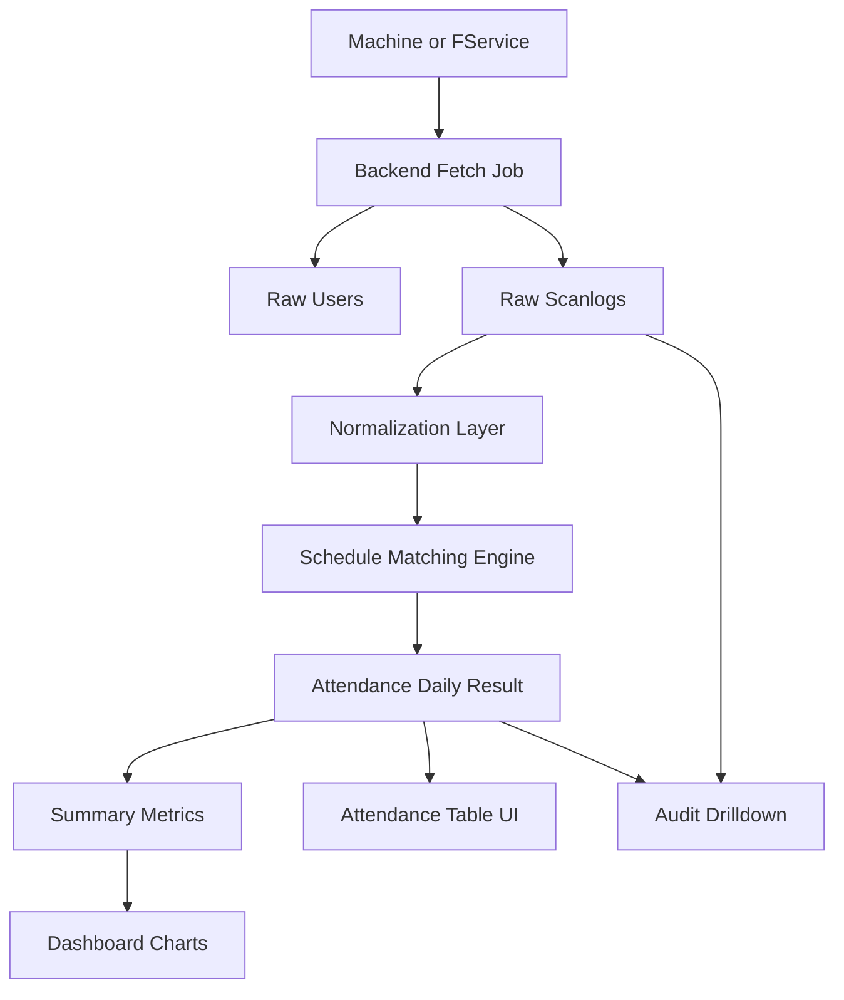

# EasyLink Attendance Flow, ORM Schema, and UX Notes

## Purpose

Dokumen ini merangkum alur data EasyLink dari mesin absensi menuju schedule, attendance result, analytics, dan tampilan dashboard yang mudah dibaca. Fokus utamanya adalah menjaga stabilitas fetch dari mesin, memisahkan raw log dari hasil olahan, dan membangun UI yang jelas untuk operator maupun admin.

## Flow explanation

### 1. Device ingestion

Mesin atau FService menjadi sumber data awal untuk device info, user, dan scanlog. Aplikasi tidak sebaiknya mengakses mesin langsung dari browser; backend harus menjadi lapisan penghubung agar timeout, retry, logging, dan keamanan lebih terkendali.

### 2. Raw data capture

Setiap data yang berhasil diambil dari mesin disimpan dulu ke tabel atau koleksi raw. Untuk scanlog, simpan data asli seperti `PIN`, `ScanDate`, `VerifyMode`, `IOMode`, dan `SN` tanpa mengubah makna dasarnya.

### 3. Normalization layer

Setelah raw tersimpan, backend melakukan normalisasi ringan: parsing timestamp, mapping mode verifikasi ke label, mapping `IOMode` ke masuk/keluar, dan penambahan metadata seperti fetch batch, fetch source, atau job id. Pada tahap ini data masih berupa event, belum menjadi absensi final.

### 4. Schedule matching

Engine absensi membaca schedule per user, per grup, atau per shift. Engine lalu membandingkan raw scanlog dengan aturan kerja seperti jam masuk, toleransi keterlambatan, cut-off checkout, grace period, serta shift lintas hari.

### 5. Attendance computation

Dari hasil matching tersebut, sistem menghasilkan satu record absensi yang lebih mudah dibaca, misalnya `first_in`, `last_out`, `late_minutes`, `early_out_minutes`, `worked_minutes`, `attendance_status`, dan `exception_flags`. Hasil ini disimpan terpisah dari raw log agar bisa direkalkulasi saat aturan berubah.

### 6. Analytics and dashboard

Dashboard tidak membaca raw log secara langsung untuk tampilan utama. Dashboard sebaiknya membaca attendance result dan metric summary agar rendering lebih ringan, query lebih cepat, dan chart lebih stabil.

## Recommended backend processing

### Fetch strategy

- Gunakan batch kecil untuk user dan scanlog besar.
- Simpan checkpoint `last_fetch_at` per device.
- Simpan partial result saat fetch panjang berjalan.
- Tambahkan retry terbatas dan delay antar batch.
- Jalankan proses besar sebagai background job, bukan request sinkron dari UI.

### Idempotency

Setiap raw scanlog perlu punya unique fingerprint, misalnya kombinasi `serial_number + pin + scan_at + io_mode + verify_mode`. Dengan begitu, retry tidak membuat data dobel.

### Work date logic

Untuk shift malam, jangan pakai tanggal kalender murni. Gunakan `work_date` berbasis jendela shift agar scan masuk malam dan scan keluar dini hari tetap dihitung sebagai satu hari kerja yang sama.

## Mermaid flow



## ORM style schema

Di bawah ini adalah contoh schema ORM style yang bisa diadaptasi ke Prisma, Drizzle, TypeORM, atau Mongoose model design.

```ts
model Device {
  id               String   @id @default(cuid())
  serialNumber     String   @unique
  name             String?
  ipAddress        String?
  port             Int?
  location         String?
  timezone         String?  @default("Asia/Jakarta")
  isActive         Boolean  @default(true)
  lastFetchAt      DateTime?
  createdAt        DateTime @default(now())
  updatedAt        DateTime @updatedAt

  rawLogs          RawScanLog[]
  rawUsers         RawMachineUser[]
  fetchJobs        FetchJob[]
}

model Employee {
  id               String   @id @default(cuid())
  pin              String   @unique
  employeeCode     String?
  fullName         String
  departmentId     String?
  shiftGroupId     String?
  joinDate         DateTime?
  isActive         Boolean  @default(true)
  createdAt        DateTime @default(now())
  updatedAt        DateTime @updatedAt

  rawUsers         RawMachineUser[]
  schedules        WorkSchedule[]
  attendanceDaily  AttendanceDaily[]
}

model RawMachineUser {
  id               String   @id @default(cuid())
  deviceId         String
  employeeId       String?
  pin              String
  name             String?
  privilege        Int?
  password         String?
  rfid             String?
  templateCount    Int?
  fetchedAt        DateTime @default(now())
  sourceJobId      String?

  device           Device   @relation(fields: [deviceId], references: [id])
  employee         Employee? @relation(fields: [employeeId], references: [id])

  @@index([deviceId, pin])
}

model RawScanLog {
  id               String   @id @default(cuid())
  deviceId         String
  employeeId       String?
  pin              String
  scanAt           DateTime
  verifyMode       Int?
  verifyLabel      String?
  ioMode           Int?
  ioLabel          String?
  workCode         Int?
  serialNumber     String
  sourceJobId      String?
  dedupeKey        String   @unique
  createdAt        DateTime @default(now())

  device           Device   @relation(fields: [deviceId], references: [id])
  employee         Employee? @relation(fields: [employeeId], references: [id])

  @@index([pin, scanAt])
  @@index([deviceId, scanAt])
}

model ShiftTemplate {
  id               String   @id @default(cuid())
  name             String
  startTime        String
  endTime          String
  crossDay         Boolean  @default(false)
  lateToleranceMin Int      @default(0)
  earlyOutToleranceMin Int  @default(0)
  checkInStartMin  Int      @default(120)
  checkOutEndMin   Int      @default(240)
  createdAt        DateTime @default(now())
  updatedAt        DateTime @updatedAt

  schedules        WorkSchedule[]
}

model WorkSchedule {
  id               String   @id @default(cuid())
  employeeId       String
  shiftTemplateId  String
  workDate         DateTime
  isOffDay         Boolean  @default(false)
  note             String?
  createdAt        DateTime @default(now())
  updatedAt        DateTime @updatedAt

  employee         Employee      @relation(fields: [employeeId], references: [id])
  shiftTemplate    ShiftTemplate @relation(fields: [shiftTemplateId], references: [id])

  @@unique([employeeId, workDate])
  @@index([workDate])
}

model AttendanceDaily {
  id                  String   @id @default(cuid())
  employeeId          String
  workDate            DateTime
  shiftTemplateId     String?
  firstInAt           DateTime?
  lastOutAt           DateTime?
  lateMinutes         Int      @default(0)
  earlyOutMinutes     Int      @default(0)
  workedMinutes       Int      @default(0)
  overtimeMinutes     Int      @default(0)
  status              String
  exceptionFlags      String?
  sourceLogCount      Int      @default(0)
  computedAt          DateTime @default(now())
  updatedAt           DateTime @updatedAt

  employee            Employee       @relation(fields: [employeeId], references: [id])
  shiftTemplate       ShiftTemplate? @relation(fields: [shiftTemplateId], references: [id])

  @@unique([employeeId, workDate])
  @@index([workDate, status])
}

model FetchJob {
  id               String   @id @default(cuid())
  deviceId         String
  jobType          String
  status           String
  batchSize        Int?
  startedAt        DateTime @default(now())
  finishedAt       DateTime?
  lastCursor       String?
  totalFetched     Int      @default(0)
  totalInserted    Int      @default(0)
  errorMessage     String?

  device           Device   @relation(fields: [deviceId], references: [id])

  @@index([deviceId, startedAt])
}
```

## Data handling notes

### Why separate raw and computed data

Raw log adalah sumber audit. Attendance daily adalah hasil aturan bisnis. Jika kamu mencampur keduanya dalam satu tabel, proses koreksi jadwal, perubahan shift, dan investigasi dispute absensi akan menjadi sulit.

### Suggested status values

Gunakan status final yang sederhana namun konsisten, misalnya:

- `present`
- `late`
- `absent`
- `leave`
- `holiday`
- `offday`
- `incomplete`
- `overtime`

### Exception flags

Simpan pengecualian seperti string JSON atau tabel relasi tambahan, misalnya:

- `missing_checkout`
- `duplicate_scan`
- `unmatched_schedule`
- `cross_day_shift`
- `manual_adjustment`

## UX revision notes

### Main dashboard structure

Buat urutan baca yang sederhana dari atas ke bawah:

1. KPI ringkas.
2. Tren harian.
3. Exception yang butuh aksi.
4. Tabel detail.
5. Audit drilldown.

### Top KPI cards

Tampilkan 4 sampai 6 kartu utama saja:

- Scheduled employees
- Present
- Late
- Absent
- Incomplete
- Overtime

Setiap kartu sebaiknya memiliki:

- angka utama besar,
- delta terhadap periode sebelumnya,
- label jelas,
- warna status yang konsisten.

### Better chart choices

Gunakan chart sesuai pertanyaan operasional:

- Line chart: attendance rate 7 atau 30 hari.
- Stacked bar: present vs late vs absent per hari.
- Heatmap: pola scan masuk per jam dan hari.
- Horizontal bar: keterlambatan per departemen atau shift.
- Exception table: lebih berguna daripada pie chart untuk kasus anomali.

Hindari terlalu banyak pie chart karena sulit dibaca saat kategori lebih dari sedikit.

### Reading hierarchy

Urutan visual yang disarankan:

- Angka besar untuk KPI.
- Ringkasan teks pendek di bawah KPI.
- Chart tengah untuk tren.
- Tabel exception di bawah sebagai area tindakan.
- Detail raw log di halaman terpisah atau drawer, bukan langsung di dashboard utama.

### Filters

Sediakan filter global yang konsisten di bagian atas:

- Date range
- Location or device
- Department
- Shift
- Status

Filter harus sticky dan hasil filter harus memengaruhi KPI, chart, dan tabel secara seragam.

### Drilldown

Saat user klik KPI `Late`, arahkan ke daftar karyawan terlambat. Dari daftar itu, user harus bisa membuka detail yang menjawab:

- Siapa orangnya
- Jadwalnya apa
- Scan pertama jam berapa
- Device mana yang menangkap scan
- Apakah ada missing checkout
- Apa raw log sumbernya

### Exception-first UX

Operator absensi biasanya lebih butuh melihat masalah daripada angka cantik. Karena itu, dashboard utama sebaiknya punya panel exception seperti:

- Missing checkout
- Unmatched schedule
- Duplicate raw logs
- Device not synced
- Fetch job failed

### Job monitoring UX

Karena fetch besar rawan timeout, tampilkan panel status job:

- job type,
- current status,
- batch ke berapa,
- total fetched,
- last success time,
- error terakhir.

Ini lebih penting daripada spinner pasif yang tidak memberi informasi.

## Suggested pages

### 1. Operations dashboard

Untuk operator harian. Fokus pada KPI, chart tren, dan exception.

### 2. Attendance explorer

Untuk filter detail absensi per user, per hari, per shift, dan status.

### 3. Raw logs explorer

Untuk audit teknis. Jangan campur penuh dengan attendance explorer.

### 4. Fetch jobs monitor

Untuk memantau proses sinkronisasi mesin, timeout, retry, dan progress.

### 5. Schedule management

Untuk mengelola shift template, work schedule, dan pengecualian.

## Good dashboard example layout

```text
[Filters: Date | Dept | Shift | Location]

[KPI Scheduled] [KPI Present] [KPI Late] [KPI Absent] [KPI Incomplete]

[Attendance trend line chart     ] [Late by department bar chart]
[Daily stacked attendance chart  ] [Device sync status panel     ]

[Exception table: missing checkout, unmatched schedule, failed fetch]

[Recent attendance detail table]
```

## Final recommendation

Bangun aplikasi dengan prinsip berikut:

- raw data immutable,
- computed attendance terpisah,
- schedule engine terdefinisi jelas,
- fetch job observable,
- dashboard berfokus pada tindakan dan exception,
- chart dipakai untuk tren dan perbandingan, bukan dekorasi.
